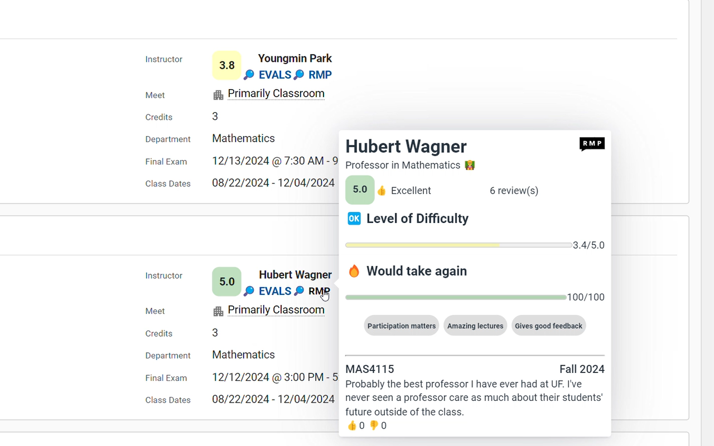
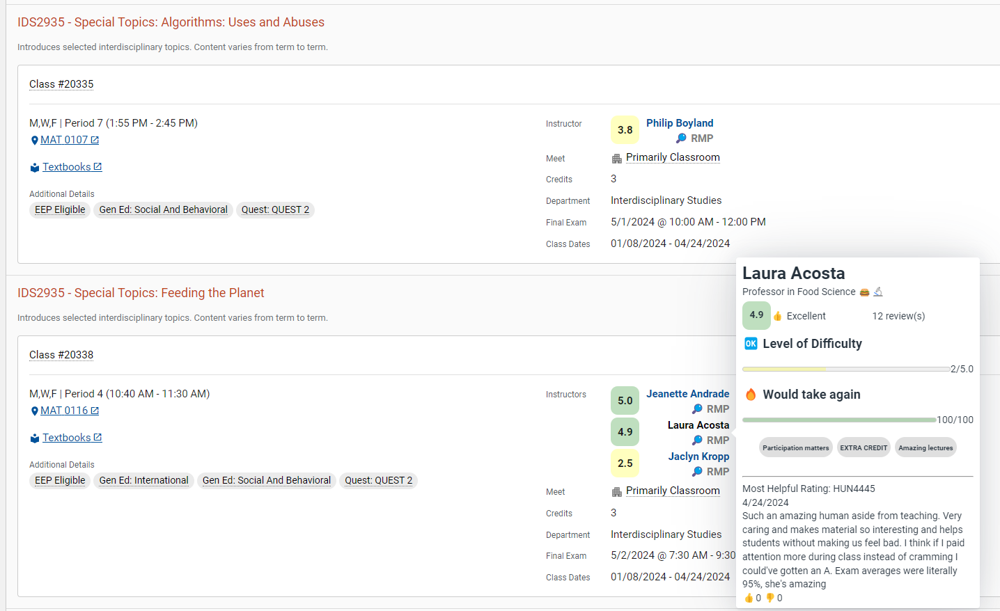

# Rate My PrUFessors Extension

[**Chrome** extension][link-chrome] 

[**Firefox** addon][link-firefox] 

[**Safari** addon][link-safari]

[**Edge** extension][link-chrome]

This extension shows the [Rate My Professors](https://www.ratemyprofessors.com/) and [GatorEvals](https://gatorevals.aa.ufl.edu/public-results/) ratings of professors while searching for classes on [ONE.UF](https://one.uf.edu/soc/).

The respective icons offer a preview of the ratings, with hyperlinks pointing to the respective rating website.

GraphQL is utilized to make API requests for RMP ratings. To better find professors while preventing false negatives, this extension utilizes input filtering by mapping certain professor names to their associated nick name (i.e. Shu-jen Huang -> Shu Huang). The search results are then compared against the original input to verify that a false negative result is not shown.

GatorEvals data was scraped from the gatorevals website using [this repository](https://github.com/jereme-yang/gatorevals-scraper). GatorEvals data is stored in plain text within the source code, and will be updated periodically as more data is available. I am working on automating this process.

[link-chrome]: https://chrome.google.com/webstore/detail/rate-my-professors-for-ri/lcionigofpcbfpmnipnioapimoggnbda?hl=en&authuser=0 "Version published on Chrome Web Store"
[link-firefox]: https://addons.mozilla.org/firefox/downloads/file/4307708/rate_my_prufessors-2.0.5.xpi "Version for Mozilla Add-ons (private)"
[link-safari]: https://TODO.com "Version for Apple Safari"

## Building

The build process goes through a few stages.

If you just want to run a build, use one of the following commands based on whether you want dev/prod builds and what browser you are building for:
- `npm run build-dev:chrome`
- `npm run build-dev:firefox`
- `npm run build:chrome`
- `npm run build:firefox`

You'll probably want to `npm install` first if you haven't already.

`npm run release` will run the `clean`, `build:chrome`, and `build:firefox` targets to generate two production zip files from a clean build folder which should be ready for distribution

To run the extension in your browser for development purposes, follow these instructions:

https://developer.mozilla.org/en-US/docs/Mozilla/Add-ons/WebExtensions/Your_first_WebExtension

Testing the output to ensure extensions are valid (using `web-ext lint`) is done automatically as part of the build process. Packaging the extension into a .zip file is also automatic.

To run unit tests: `npm run test`