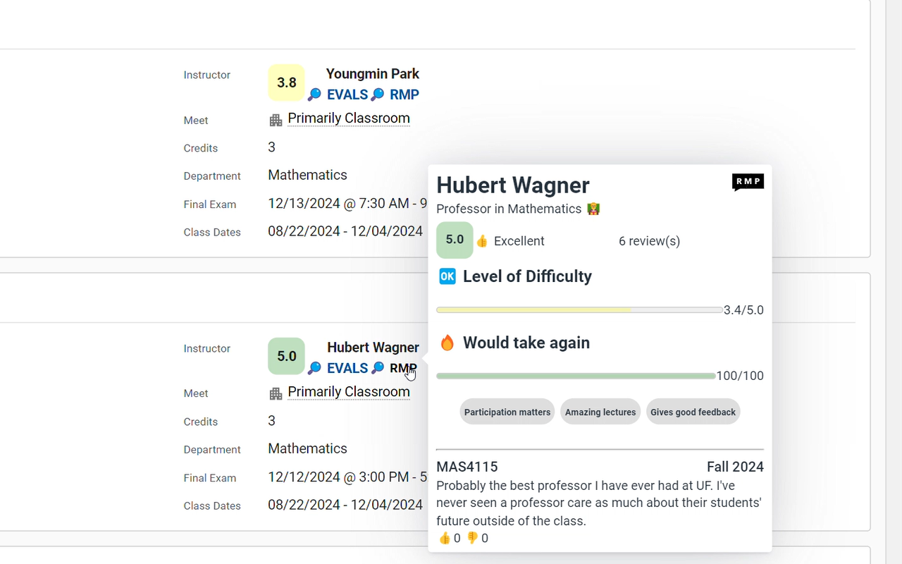
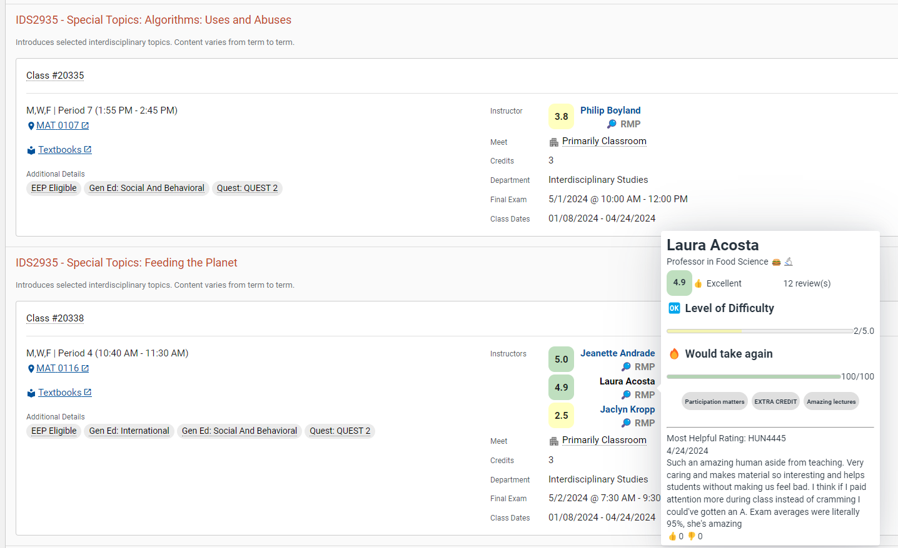

# Rate My PrUFessors Extension

[**Chrome Extension**](https://chromewebstore.google.com/detail/rate-my-prufessors/aabhhefmldjjhcnacbpgooeanamkallk?hl=en) | [**Edge Extension**](https://chromewebstore.google.com/detail/rate-my-prufessors/aabhhefmldjjhcnacbpgooeanamkallk?hl=en)

---

This browser extension enhances the [ONE.UF course search](https://one.uf.edu/soc/) by displaying professor ratings from both:

- [Rate My Professors](https://www.ratemyprofessors.com/)
- [GatorEvals](https://gatorevals.aa.ufl.edu/public-results/)

Directly alongside instructor names, you’ll see icons showing preview ratings. Clicking the icons links you to the respective rating website for more details.

---

## How It Works

- **Rate My Professors (RMP)** data is fetched live using GraphQL API requests.
- To improve matching and prevent false negatives, the extension filters professor names by mapping common nicknames (e.g., _Shu-jen Huang_ → _Shu Huang_) before querying RMP.
- **GatorEvals** ratings come from scraped data hosted in this repository’s backend (built with AWS Lambda and DynamoDB). Currently, GatorEvals data is embedded in the extension source code and updated periodically.
- Automation for updating GatorEvals data is in progress—check out the [`aws-backend` branch](https://github.com/jereme-yang/gatorevals-scraper/tree/aws-backend) for implementation details.

---

## Screenshots

  


---

## Building the Extension

### Prerequisites

Make sure you have [Node.js](https://nodejs.org/) and npm installed.

### Install dependencies

```bash
npm install
```

### Build commands

Choose the appropriate command based on your target browser and environment:

| Command                     | Description                   |
| --------------------------- | ----------------------------- |
| `npm run build-dev:chrome`  | Development build for Chrome  |
| `npm run build-dev:firefox` | Development build for Firefox |
| `npm run build:chrome`      | Production build for Chrome   |
| `npm run build:firefox`     | Production build for Firefox  |

### Release

To generate clean production-ready zip files for distribution (Chrome and Firefox), run:

```bash
npm run release
```

This command runs clean, build:chrome, and build:firefox sequentially, producing ready-to-publish extension packages.
